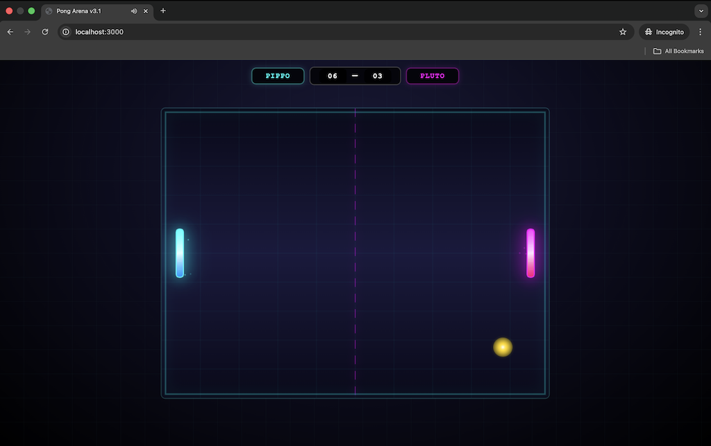
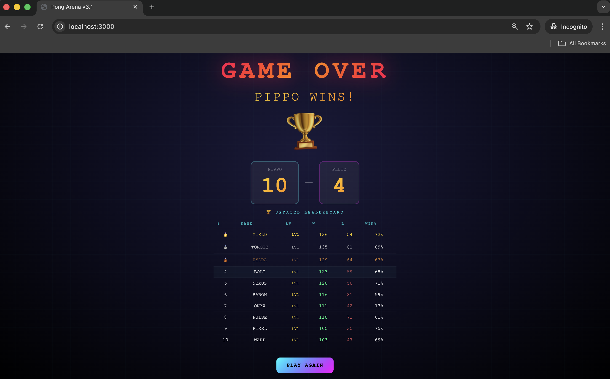

# 🏓 PONG ARENA

[](https://deewhy.ovh/pongarena/)
[](LICENSE)
[](https://nodejs.org)
[](https://socket.io)

**Classic Pong, Reimagined for the Modern Era** — Real-time multiplayer, cosmetic shop, XP progression, and global leaderboards.

## ✨ Game Preview

## ✨ Game Preview

| 🕹️ Gameplay | 🏆 Game Over |
| :---: | :---: |
|  |  |

## ✨ Features

- **Real-time Multiplayer** — Challenge players worldwide with Socket.io
- **Account System** — Email/Password or Google Sign-in via Firebase
- **XP & Leveling** — Earn XP from matches, level up (1-100)
- **Coin Economy** — Earn coins from wins, spend in cosmetic shop
- **Cosmetic Shop** — Unlock paddle skins and ball trails
- **Leaderboards** — Global rankings based on wins
- **Power-ups** — Speed boosts and size modifiers during matches
- **Daily Streaks** — Login daily for bonus coins

## 🎮 Play Now

The game is live at: **[https://deewhy.ovh/pongarena/](https://deewhy.ovh/pongarena/)**

## 🛠️ Tech Stack

| Component | Technology |
|-----------|------------|
| Backend | Node.js + Express |
| Real-time | Socket.io |
| Database | Firebase Firestore |
| Auth | Firebase Authentication |
| Frontend | Vanilla JS + Canvas |
| Hosting | Custom Server (deewhy.ovh) |

## 🚀 Local Development

```bash
# Clone repository
git clone https://github.com/github-deewhy/pong-arena.git
cd pong-arena

# Install dependencies
npm install

# Run development server with auto-reload
npm run dev

# Or start production server
npm start
```

Visit `http://localhost:3000`

## 📁 Project Structure

```
pong-arena/
├── server.js                 # Main server (Express + Socket.io)
└── public/                   # GitHub Pages marketing site
|   ├── index.html            # Main game HTML
|   ├── style.css             # Main game styles
|   └── game.js               # Client-side game logic
|   └── firebase-config.js    # Firebase auth & Firestore 
├── package.json              # Dependencies
└── docs/                     # GitHub Pages marketing site
    ├── index.html            # Landing page
    ├── style.css             # Landing page styles
    └── assets/               # Images, screenshots
```

## 🎯 Core Systems

### XP & Leveling
- **Win**: +100 XP | **Loss**: +40 XP
- **Each point scored**: +5 XP
- **Perfect win** (opponent scores 0): +75 XP bonus
- **Comeback win** (trailing by 3+): +50 XP bonus
- **100 levels** with increasing requirements

### Coin Economy
- **Win**: 10 🪙 | **Loss**: 5 🪙
- **Daily first win**: +25 🪙 bonus
- **Login streak bonuses**: 5-100 🪙
- Spend coins on cosmetic items

### Cosmetic Shop

#### Paddle Skins
| Skin | Emoji | Level Req | Coin Cost |
|------|-------|-----------|-----------|
| Classic | 🏓 | 0 | Free |
| Fire | 🔥 | 5 | 50 |
| Ice | ❄️ | 15 | 80 |
| Neon | ⚡ | 30 | 120 |
| Galaxy | 🌌 | 50 | 200 |
| Gold | 👑 | 75 | 350 |

#### Ball Trails
| Trail | Emoji | Level Req | Coin Cost |
|-------|-------|-----------|-----------|
| Classic | ⚪ | 0 | Free |
| Comet | ☄️ | 10 | 60 |
| Flame | 🔥 | 25 | 100 |
| Rainbow | 🌈 | 45 | 180 |
| Ghost | 👻 | 60 | 250 |

## 🔧 Configuration

The game uses Firebase for authentication and data storage. Configuration is in `firebase-config.js`:

```javascript
const firebaseConfig = {
  apiKey: "[Your Firebase apiKey]",
  authDomain: "[Your Firebase authDomain].firebaseapp.com]",
  projectId: "[Your Firebase ProjectId]",
  // ...
};
```

## 📊 API Endpoints

| Endpoint | Method | Description |
|----------|--------|-------------|
| `/api/leaderboard` | GET | Top 20 players |
| `/api/register` | POST | Register new user |
| `/api/daily-login` | POST | Daily login bonus |
| `/api/xp/:uid` | GET | Player XP & level |
| `/api/shop/:uid` | GET | Shop inventory |
| `/api/shop/purchase` | POST | Buy item |
| `/api/shop/equip` | POST | Equip item |
| `/api/user/:uid` | GET | User profile |

## 🎮 Game Controls

- **W / Arrow Up** — Move paddle up
- **S / Arrow Down** — Move paddle down
- **Ready button** — Mark yourself ready in room
- **Create Room** — Host a new game
- **Join Room** — Join existing game

## 🔄 Game Flow

```
Auth → Lobby → Room → Countdown → Game → Game Over → Lobby
```

1. **Auth**: Sign in with email/password or Google
2. **Lobby**: See open rooms, create/join games
3. **Room**: Ready up, wait for opponent
4. **Countdown**: 3-2-1-GO!
5. **Game**: Play until someone reaches 10 points
6. **Game Over**: Show results, XP earned, updated leaderboard

## 🗄️ Database Schema

### `leaderboard/{uid}`
```javascript
{
  uid: string,
  displayName: string,
  wins: number,
  losses: number,
  matchesPlayed: number,
  xp: number,
  level: number,
  coins: number,
  loginStreak: number,
  lastLoginDate: string,  // YYYY-MM-DD
  lastWinDate: string,    // YYYY-MM-DD
  ownedItems: string[],   // item IDs
  equippedItems: {
    paddle: string,
    trail: string
  },
  createdAt: string,
  updatedAt: string
}
```

### `matches/{auto}`
```javascript
{
  roomId: string,
  timestamp: string,
  duration: number,  // seconds
  p1Uid: string, p1Name: string, p1Score: number,
  p2Uid: string, p2Name: string, p2Score: number,
  winnerUid: string, winnerName: string,
  loserUid: string, loserName: string
}
```

## 📝 Environment Variables

Create a `.env` file for local development:

```env
PORT=3000
FIREBASE_PROJECT_ID=[Your Firebase ProjectId]
FIREBASE_API_KEY=[Your Firebase apiKey]
```

## 🧪 Testing

```bash
# Run with nodemon for development
npm run dev

# Manual testing
# 1. Open two browser windows
# 2. Sign in with different accounts
# 3. Create room in one, join in another
# 4. Play game
```

## 📈 Future Roadmap

| Phase | Status | Description |
|-------|--------|-------------|
| Phase 1 | ✅ Complete | XP + Levels |
| Phase 2 | ✅ Complete | Coin system + daily rewards |
| Phase 3 | ✅ Complete | Cosmetic shop UI + skins |
| Phase 4 | 🔜 Planned | Ranked seasons + season pass |
| Phase 5 | 🔜 Planned | Premium membership + Stripe |
| Phase 6 | 🔜 Planned | Power-up loadouts |

## 🤝 Contributing

Contributions are welcome! Here's how you can help:

1. **Fork** the repository
2. **Create** a feature branch (`git checkout -b feature/amazing`)
3. **Commit** your changes (`git commit -m 'Add amazing feature'`)
4. **Push** to the branch (`git push origin feature/amazing`)
5. **Open** a Pull Request

### Development Guidelines
- Keep code style consistent with existing files
- Test multiplayer functionality with two clients
- Update documentation for new features
- Ensure Firebase security rules are updated

## 📝 License

MIT License — see [LICENSE](LICENSE) file for details.

## 🙏 Acknowledgments

- **Classic Pong** by Atari (1972) for the inspiration
- **Firebase** for authentication and database
- **Socket.io** for real-time communication
- All players who've contributed feedback

## 📬 Contact & Links

- **Live Game**: [https://deewhy.ovh/pongarena/](https://deewhy.ovh/pongarena/)
- **GitHub**: [https://github.com/github-deewhy/pong-arena](https://github.com/github-deewhy/pong-arena)
- **Documentation**: [DESIGN.md](DESIGN.md)
- **Issues**: [Report a bug](https://github.com/github-deewhy/pong-arena/issues)

---

<p align="center">
  Made with ❤️ by <a href="https://github.com/github-deewhy">github-deewhy</a>
  <br>
  <sub>Built for the love of classic arcade games and modern web tech</sub>
</p># pong-arena
